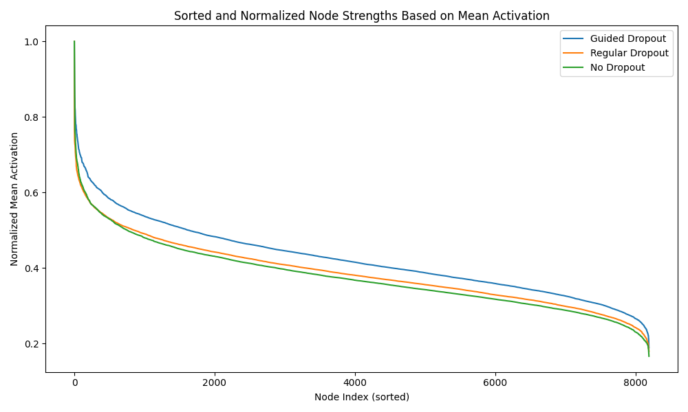
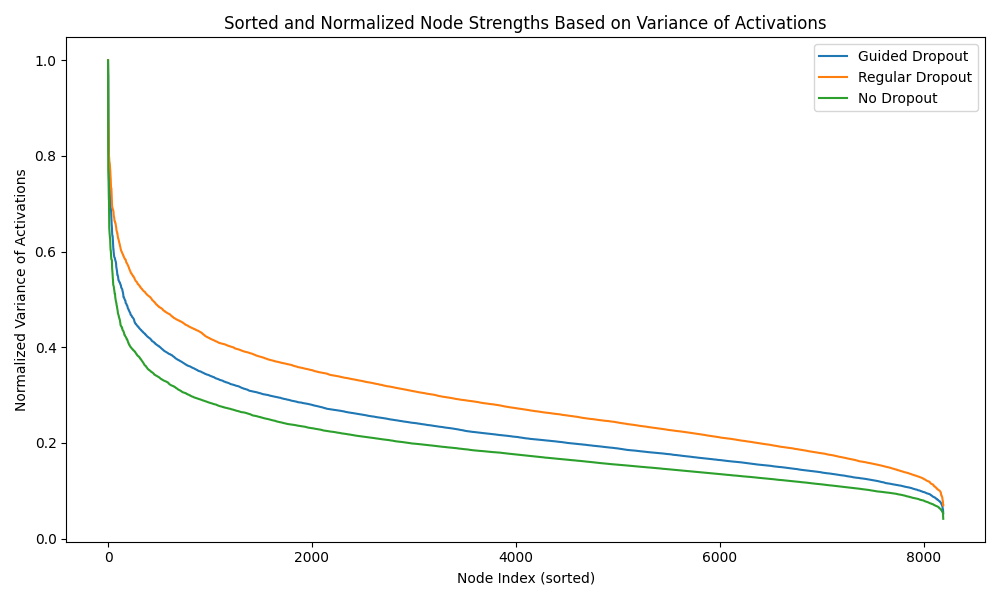

# Guided Dropout Experiments on CIFAR-10

This repository contains an implementation of Guided Dropout as described in the paper:

> Keshari, Rohit, Richa Singh, and Mayank Vatsa. "Guided dropout." Proceedings of the AAAI Conference on Artificial Intelligence. Vol. 33. No. 01. 2019.

## Introduction

Guided Dropout is a regularization technique that selectively drops nodes based on their learned strength during training, encouraging weaker nodes to contribute more to the model's performance.

In this experiment, we compare:

- **Guided Dropout**
- **Regular Dropout**
- **No Dropout**

We train a neural network with 3 hidden layers of 8192 nodes each on the CIFAR-10 dataset.

## Model Architecture and Activation Functions

### Neural Network Structure

The neural network consists of:

- Input Layer: Flattened image of size $3 \times 32 \times 32 = 3072$ features.
- Hidden Layers: Two fully connected layers with 8192 nodes each.
- Output Layer: A fully connected layer with 10 nodes (for the 10 classes in CIFAR-10).

### Activation Functions

We use the **Rectified Linear Unit (ReLU)** activation function in all hidden layers.

The ReLU activation function is defined as:

$$f(z) = \max(0, z)$$

Where:
- $z$ is the input to the activation function.

### Guided Dropout with Strength Parameter

In the Guided Dropout model, each node in the hidden layers has an associated **strength parameter** $t_j$, which is learned during training.

The activation of node $j$ in layer $l$ is given by:

$$a_j^{(l)} = t_j^{(l)} \cdot f\left( z_j^{(l)} \right)$$

Where:
- $t_j^{(l)} \in [0, 1]$ is the strength parameter for node $j$ in layer $l$.
- $f\left( z_j^{(l)} \right)$ is the ReLU activation of node $j$.

### Guided Dropout Mechanism

During training, we apply Guided Dropout by:

1. **Calculating the median strength value** in the layer to divide nodes into active and inactive regions.
2. **Identifying active nodes**: Nodes with strength values greater than the median.
3. **Randomly dropping nodes** from the active region with a specified dropout rate $(1 - \theta)$.

This encourages weaker nodes (with lower $t_j^{(l)}$) to contribute more to the network's learning process.

## Signal Strength Metrics

We measure the signal strength of each node in the first hidden layer using the following metrics:

### 1. Mean Activation

The mean activation of node `j` is calculated as:

```
Mean Activation_j = (1/N) * Σ [a_j^(1)(x_i)] for i = 1 to N
```

Where:
- `N` is the number of samples in the dataset.
- `a_j^(1)(x_i)` is the activation of node `j` for input sample `x_i`.

### 2. Variance of Activations

The variance of activations for node `j` is calculated as:

```
Variance_j = (1/N) * Σ [(a_j^(1)(x_i) - μ_j)^2] for i = 1 to N
```

Where:
- `μ_j` is the mean activation of node `j`.

### 3. Signal-to-Noise Ratio (SNR)

The SNR for node `j` is calculated as:

```
SNR_j = μ_j / (σ_j + ε)
```

Where:
- `μ_j` is the mean activation of node `j`.
- `σ_j = sqrt(Variance_j)` is the standard deviation of node `j`'s activations.
- `ε` is a small constant added to prevent division by zero.
```

## Results

### Test Accuracy

| Model             | Test Accuracy (%) |
|-------------------|-------------------|
| Guided Dropout    | 57.34%             |
| Regular Dropout   | 59.49%              |
| No Dropout        | 60.23%              |

### Strength Values Visualization

We visualize the node signal strengths in the first hidden layer using the three metrics described above.

#### Mean Activation Strengths


#### Variance of Activations Strengths


#### Signal-to-Noise Ratio (SNR) Strengths


*Each plot shows the sorted and normalized node strengths for the Guided Dropout, Regular Dropout, and No Dropout models.*

## How to Run

### Install Dependencies

```bash
pip install -r requirements.txt
```

### Train Models

#### Guided Dropout

```bash
python train.py --model guided --epochs 10
```

#### Regular Dropout

```bash
python train.py --model regular --epochs 10
```

#### No Dropout

```bash
python train.py --model none --epochs 10
```

### Visualizing Activation Strengths

After training all three models, you can visualize the node signal strengths.

#### Run the Visualization Script

```bash
python visualize_activation_strengths.py
```

#### Generated Plots

The script will generate three plots:

1. **Mean Activation Strengths** (`mean_activation_strengths.png`)
2. **Variance of Activations Strengths** (`variance_of_activations_strengths.png`)
3. **Signal-to-Noise Ratio (SNR) Strengths** (`snr_strengths.png`)

Each plot shows the **sorted and normalized** node strengths for each model, allowing for comparison between Guided Dropout, Regular Dropout, and No Dropout models.

### Interpreting the Plots

- **Mean Activation**: Indicates the average output of each node. Higher mean activations may suggest nodes that are more active on average.

- **Variance of Activations**: Shows how much the node's activation varies across different inputs. Nodes with higher variance are more sensitive to input changes.

- **Signal-to-Noise Ratio (SNR)**: Combines mean and variance to show nodes that have consistent and strong activations relative to their variability.

Normalization is applied to each model's node strengths by dividing all values by the maximum value in that model, so that the maximum normalized strength is 1 for each model.

These plots help in understanding how Guided Dropout affects the activation patterns of nodes compared to regular dropout and no dropout.

## References

- [Guided Dropout Paper](https://arxiv.org/abs/1812.03965)


## Plots

_strengths.png)
